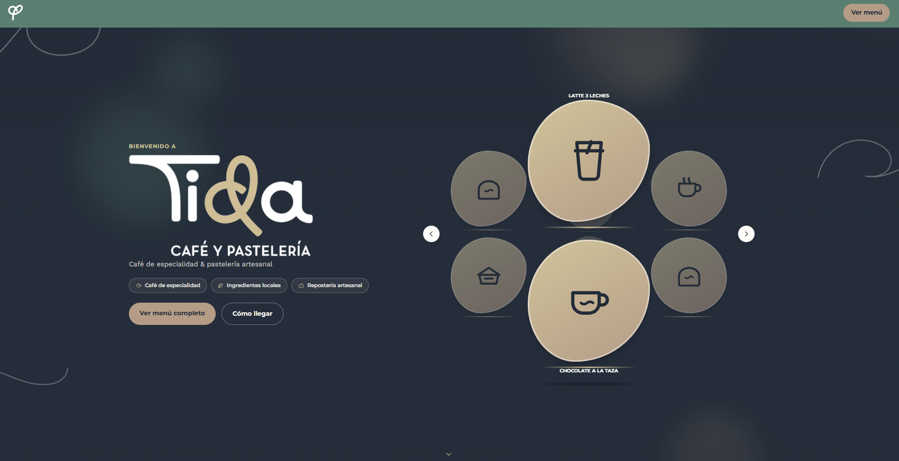

# Tida — Café & Bakery Menu

A responsive, animated digital menu for a café and bakery, with a full admin panel to manage the menu without touching code. Built with **PHP, MySQL and vanilla JavaScript**.

**Live site:** https://tidave.com



## Features

**Public site**
- Animated landing page with an interactive, rotating product showcase (vitrina) and a rotating hero background.
- Menu organized by categories, each with its own theme color, tagline and optional product photos.
- Discounts applied automatically, shown as a struck-through price next to the new one.
- Optional featured promotion (image or video) and an embedded Instagram post on the home page.
- Location, opening hours and social links driven by the site settings.

**Admin panel** (`/admin`)
- Secure login with session protection and CSRF tokens.
- **Categories:** create, edit, reorder and delete menu sections.
- **Products:** name, description, price (or a custom note such as "price per unit"), featured flag, order and an optional photo.
- **Discounts:** percentage or fixed amount, applied to the whole menu, a category or a single product, optionally limited to specific weekdays.
- **Settings:** site name, address, hours, WhatsApp, Instagram, promotion, hero backgrounds and password change.
- Uploaded photos are automatically compressed and converted to WebP.

## Tech stack

PHP 8 (PDO) · MySQL / MariaDB · HTML5 · CSS3 (design tokens) · Vanilla JavaScript

## Security

- Passwords stored with bcrypt (`password_hash` / `password_verify`).
- All database access through PDO prepared statements.
- CSRF token on admin forms, compared with `hash_equals`.
- Session ID regenerated on login.
- `includes/` and `database/` blocked from web access with `.htaccess`.
- Credentials kept out of the repository (`includes/config.php` is git-ignored; use the provided example file).

## Project structure

```
admin/        Admin panel (login, categories, products, discounts, settings)
assets/       Shared CSS design tokens
database/     schema.sql (tables + starter menu) and migrations
includes/     Config, DB connection, auth, helpers, upload handling
menu/         Public menu page (index.php, script.js, styles.css)
index.php     Landing page (landing.js / landing.css)
uploads/      Photos and videos uploaded from the panel (git-ignored)
```

## Getting started (local, XAMPP)

**Requirements:** PHP 8+ with the GD extension (WebP support) and MySQL/MariaDB.

1. Clone the repository into your web root (for XAMPP: `C:\xampp\htdocs\tida`).
2. In phpMyAdmin, create an empty database (for example `tida`) and import `database/schema.sql`.
3. Copy `includes/config.example.php` to `includes/config.php` and fill in your database details. On XAMPP: host `localhost`, user `root`, empty password.
4. Make sure `uploads/` and its subfolders are writable by the web server.
5. Open `http://localhost/tida/` for the site and `http://localhost/tida/admin/login.php` for the panel.

**Admin account.** `schema.sql` creates a default `admin` user. Replace its password hash before any real deployment:

```bash
php -r "echo password_hash('your-new-password', PASSWORD_BCRYPT);"
```

Paste the result into the `INSERT INTO admin_usuarios` line of `database/schema.sql` before importing, or update the row in phpMyAdmin afterwards. You can also change the password from **Settings → Security** inside the panel.

## Notes

Built for a real business. Code shared with the owner's permission; the live site content and brand belong to the owner.
